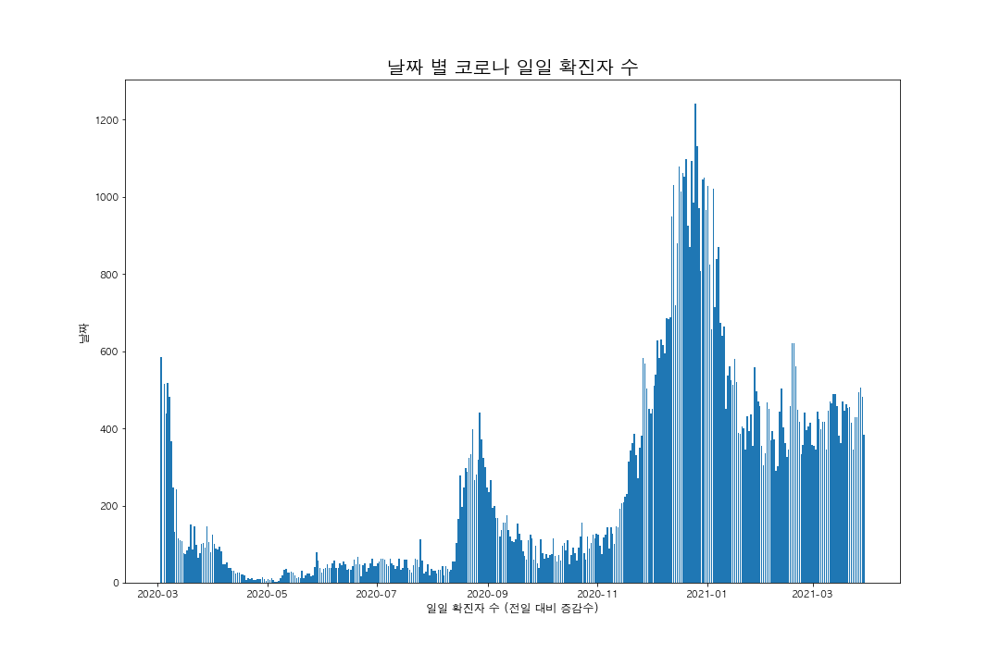
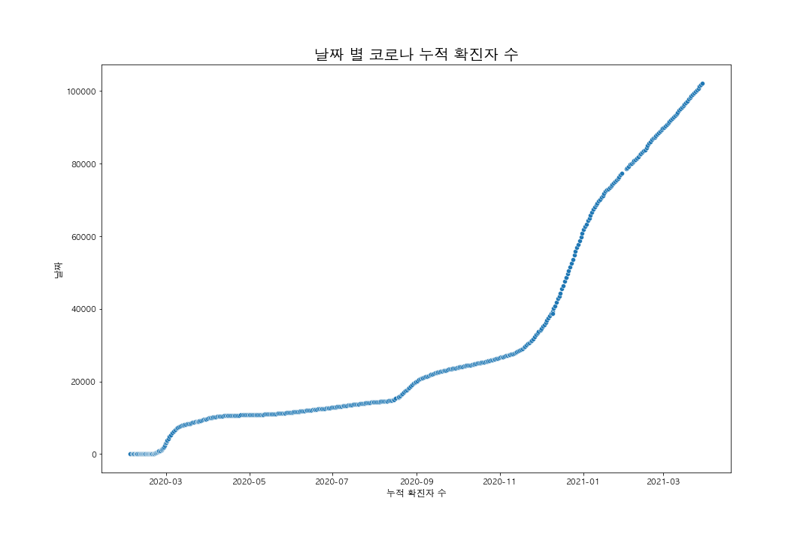
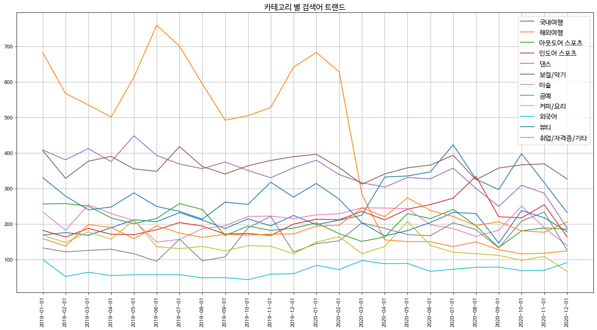
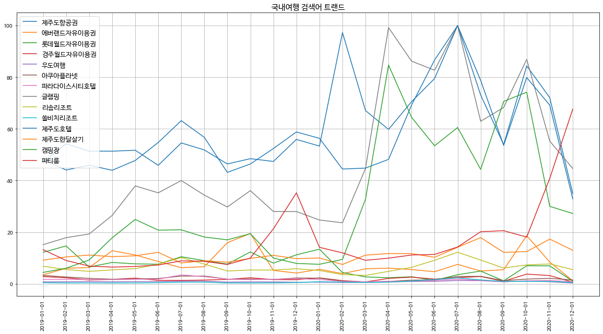
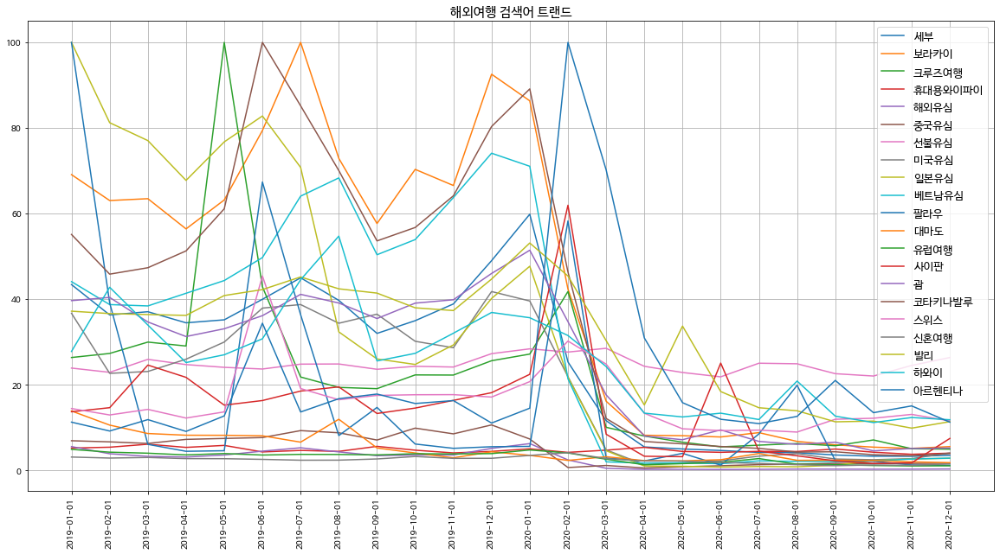
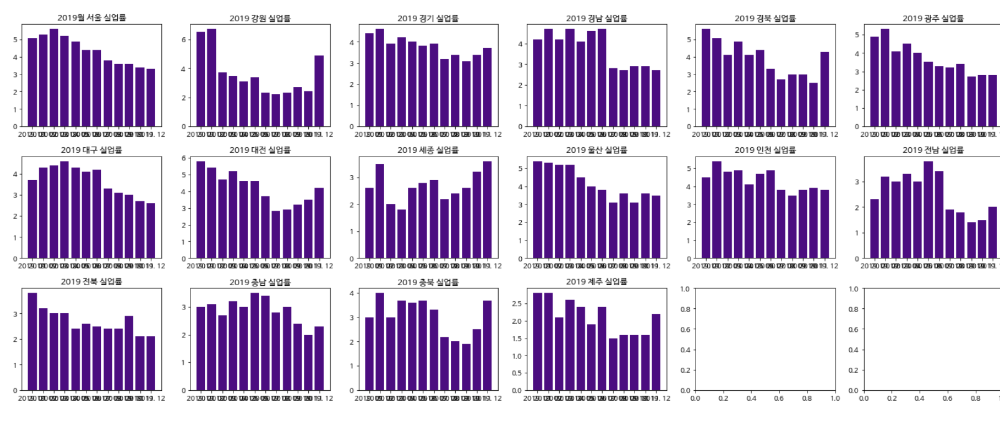
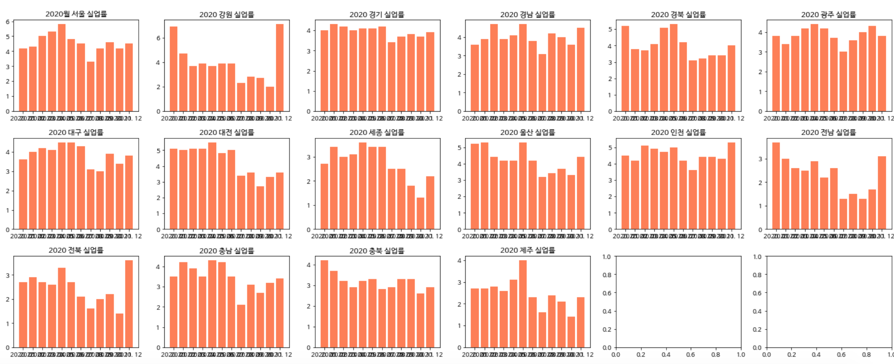

# COVID-19 Data Visualization
## 코로나 데이터 시각화

2021.04.02부터 2021.04.09까지 진행된 멋쟁이사자처럼 코로나 데이터 시각화 경진대회

지난 2020년 3월 29일부터 2020년 5월 10일까지 진행된 DACON [코로나 데이터 시각화 AI 경진대회](https://dacon.io/competitions/official/235590/overview/description/) 
데이터 및 공공 데이터를 활용하여 코로나로 인한 사회적, 경제적 영향을 분석한다.

## 데이터 분석
기존 DACON 데이터는 2020년 상반기까지의 데이터만 있어 분석에 미흡함이 있어 코로나 누적 확진자 공공 데이터 및 
네이버 DataLabs 및 구글 유동인구 데이터 등을 활용하여 데이터를 분석하고 인사이트를 도출하였다.

완성된 코드는 [주피터 노트북](./covid19-EDA.ipynb)으로 작성되었고 [최종 제출 파일](output/COVID19-EDA-final.pdf)은 PDF로 작성되었다.

1. [DACON 제공 코로나 데이터](https://dacon.io/competitions/official/235590/data/)
2. [한국 데이터 거래소 코로나 현황 누적 데이터](https://kdx.kr/data/view/25918)
3. [네이버 DataLabs 검색어 트랜드](https://datalab.naver.com/)
4. [구글 유동인구 데이터](https://www.google.com/covid19/mobility/)
5. [기상청 날씨 데이터](https://data.kma.go.kr/cmmn/main.do)
6. [국가통계포털 데이터](https://kosis.kr/)

## 데이터 시각화
데이터 시각화 경진대회를 통해 만든 시각화 자료를 일부 첨부한다. 

전체 코드는 [주피터 노트북 코드](./covid19-EDA.ipynb)에서 확인할 수 있고 그 외 이미지는 [output](./output)에서 확인 가능하다.

